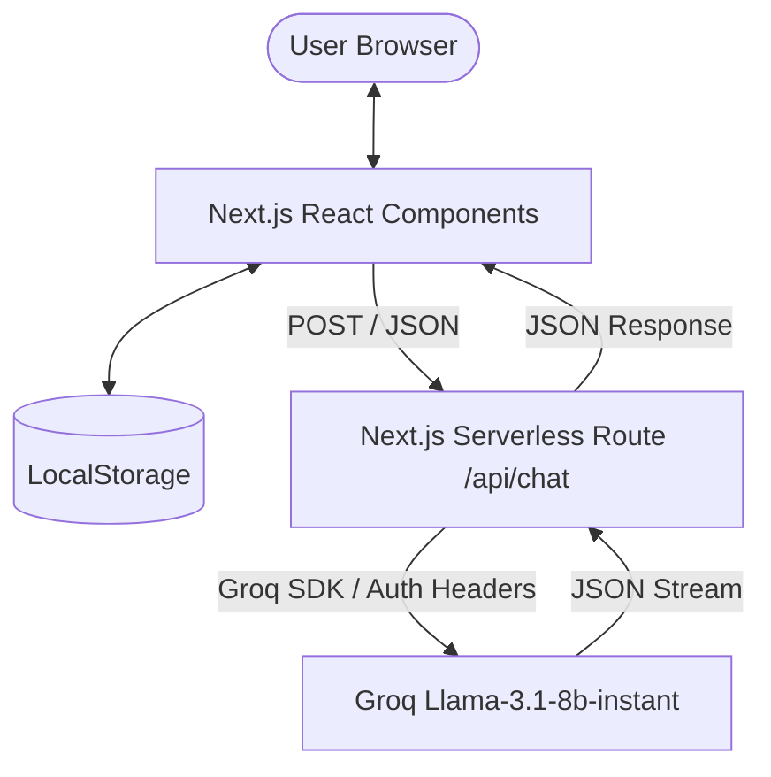

# 🏛️ System Design – Study Buddy (AI Academic Assistant)

**Author:** Md Umair Alam (IIT Delhi)  
**Date:** March 2026 (Updated for Groq Integration)  
**Repository:** [GitHub](https://github.com/Umair-IITD/Study-Buddy)  
**Environment:** Next.js 15 (App Router), deployed on Vercel.

---

## 🧐 Purpose & Technical Goals

**Study Buddy** is an intelligent AI agent platform designed to automate the manual cognitive load of study planning and concept clarification.

**Core Technical Objectives:**
- **Inference Speed**: Minimize Time-to-First-Token (TTFT) using specialized hardware-accelerated LLM inference.
- **Security Protocols**: Maintain strict separation between client-side UI and server-side secret management.
- **Adaptive UX**: Deliver a high-retention user experience using a custom design system with full theme-awareness.

---

## 🛠️ High-Level Architecture

### Flow Sequence
1. **Request**: The user submits a prompt via the `ChatInput` component.
2. **Contextual Enrichment**: The client maps the existing `localStorage` history to the standardized OpenAI-style role format.
3. **Secure Bridge**: The frontend calls the serverless `/api/chat` route.
4. **Backend Processing**: The server retrieves the `SB_API_KEY` from the environment, initializes the `groq-sdk`, and injects the **System Instruction** (persona context) to the message array.
5. **Inference**: The LLM processes the request based on the "Academic Mentor" instruction set.
6. **Persistence**: The response is returned, the UI state is updated, and the new interaction is persisted to `localStorage`.

---

## 🧠 Model Selection & Prompt Engineering

### Inference Engine: Groq Llama-3.1-8b-instant
Migrated from Google's Gemini to Groq's Llama-3.1 to leverage the ultra-fast LPUs (Language Processing Units). This reduces latency from seconds to milliseconds, enabling seamless real-time interactions.

### Persona: The Academic Mentor
The system instruction (found in `lib/groq.js`) defines a specific set of operational boundaries:
- **Scaffolded Learning**: The AI is instructed to provide step-by-step guidance over direct solutions.
- **Plagiarism Prevention**: Explicit instructions to refuse generation of complete exam answers.
- **Tone & Voice**: Friendly, encouraging, and academically rigorous.

---

## 🔐 Security & Deployment Strategy

- **Environment Variables**: `SB_API_KEY` is strictly server-side. Next.js App Router prevents this variable from being bundled into client-side JS.
- **CORS & Origin Control**: Deployment is restricted to Vercel's production origins.
- **Data Privacy**: No PII is sent to external logs. Chat history is stored entirely in the user's browser via `localStorage`, ensuring zero server-side data retention.

---

## 🎨 UI/UX Design System

The platform follows a **Custom Design System** with CSS Tokens:
- **Theme-Awareness**: Utilizing `next-themes` and a centralized `globals.css` with variable mapping (`--bg-primary`, `--accent`, etc).
- **Smooth Interaction**: CSS transitions and `framer-motion`-style animations (standardized via pure CSS) provide a premium feel.
- **Component Modularization**: Atomic design principles applied (Atomic components: `IconBtn`, `ChatMessage`, etc. Molecules: `ChatSidebar`, `ChatArea`).

---

## 📈 Future Scalability Path

1. **RAG Pipeline**: Introduction of a Vector DB (Pinecone/Supabase Vector) for indexing user-uploaded PDFs and textbook chapters.
2. **Persistence Layer**: Migration to PostgreSQL (Supabase) for cross-device authentication and session sync.
3. **Multi-Agent Orchestration**: Splitting logic into a "Planner Agent" (scheduling) and an "Execution Agent" (tutoring).

---
MD Umair Alam, 2026.
Designed with ❤️ at IIT Delhi.